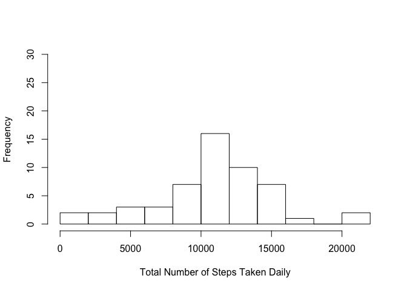

# Reproducible Research: Peer Assessment 1
Sam Edgemon  
April 16, 2015  


#### Loading and Processing the Data

- set my working directory
- read in the zipped file, unzip it, and save it as "data"
- format date


```r
setwd("~/GitHub/RepData_PeerAssessment1")  
activity <- read.table(unz("activity.zip", "activity.csv"), header=T, quote="\"", sep=",")   
activity$date <- as.Date(activity$date)
```
  
#### What is mean total number of steps taken per day?

- Built dataset without missings
- Found daily steps
- Got mean


```r
activity.ignore.na <- na.omit(activity)
daily.steps <- rowsum(activity.ignore.na$steps, format(activity.ignore.na$date, '%Y-%m-%d')) 
daily.steps <- data.frame(daily.steps) 
names(daily.steps) <- ("steps") 
mean(daily.steps$steps)
```

```
## [1] 10766.19
```

```r
hist(daily.steps$steps, 
     main=" ",
     breaks=10,
     xlab="Total Number of Steps Taken Daily")
```

 


### What is the average daily activity pattern?


### Imputing missing values


### Are there differences in activity patterns between weekdays and weekends?
